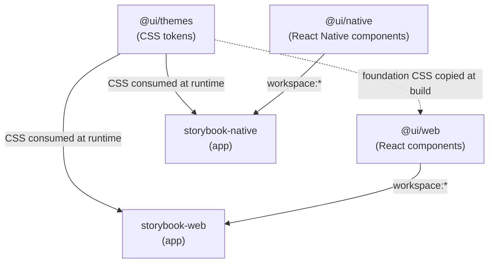
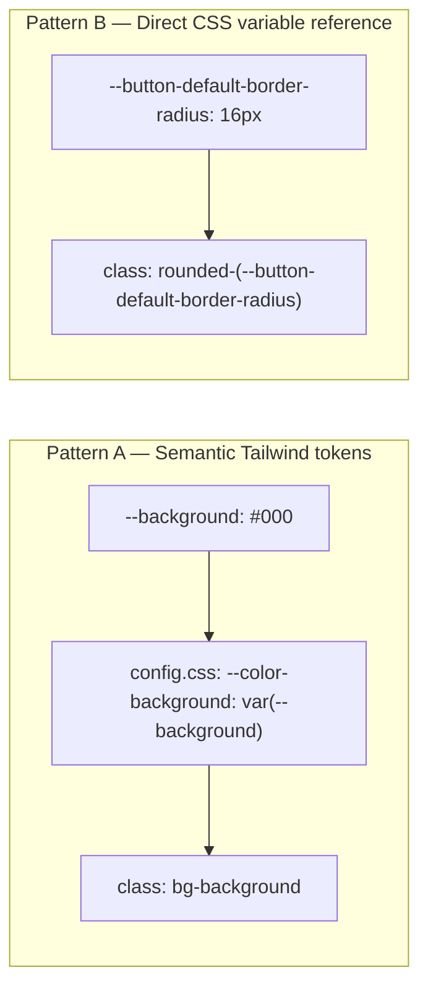
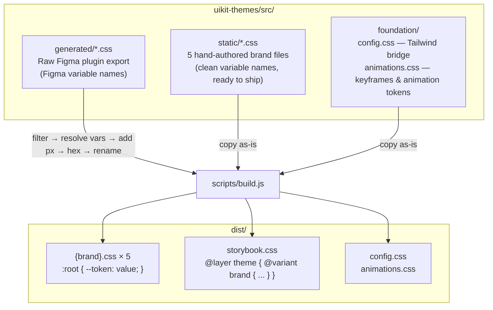
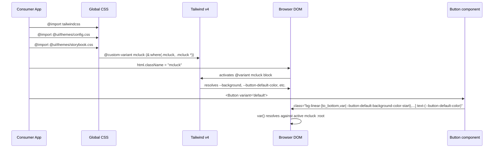
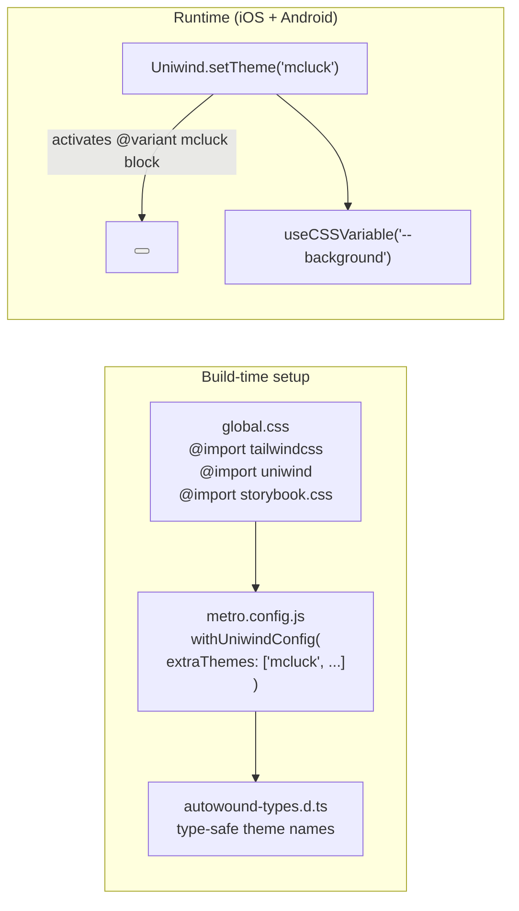
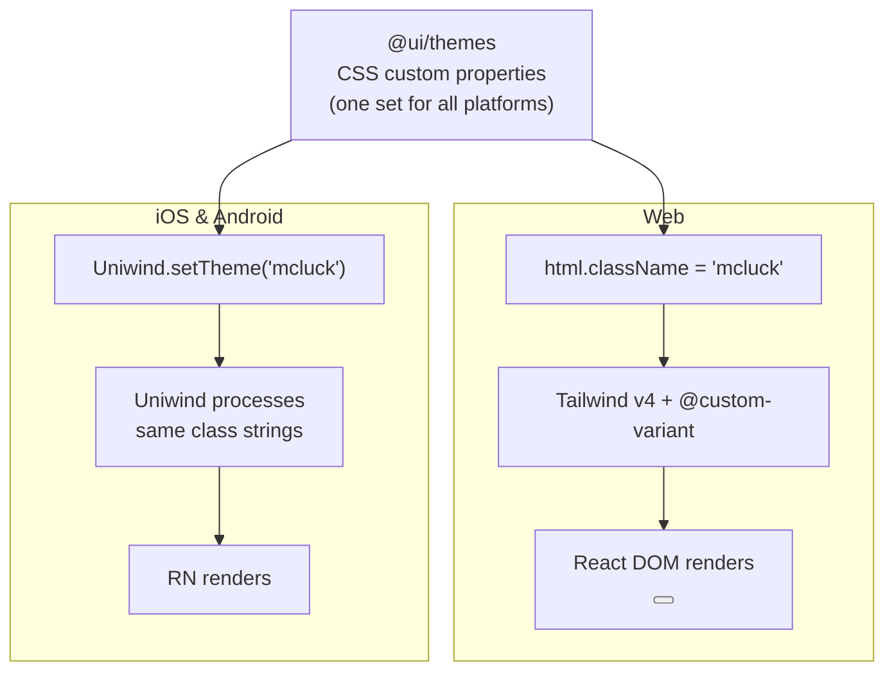
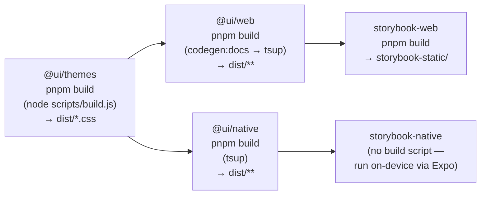

# B2Spin UIKit — Architecture & Theming

This document explains how the `b2spin-uikit` monorepo is structured, how its component model works, and — most importantly — how multi-brand theming flows from design tokens all the way to rendered pixels on web, iOS, and Android.

> New to design systems or this repo? Start with [DESIGN-SYSTEM-BASICS.md](DESIGN-SYSTEM-BASICS.md) for a concept-first primer (tokens, UI kits, component libraries, shadcn/ui), then come back here for the deep mechanics.

---

## Table of Contents

1. [Monorepo Overview](#1-monorepo-overview)
2. [Package Responsibilities](#2-package-responsibilities)
3. [Component Model](#3-component-model)
4. [Theming System](#4-theming-system)
5. [Web Theming Flow](#5-web-theming-flow)
6. [Native Theming Flow (iOS & Android)](#6-native-theming-flow-ios--android)
7. [Brands](#7-brands)
8. [Build, Codegen & MCP](#8-build-codegen--mcp)
9. [Known Gaps](#9-known-gaps)

---

## 1. Monorepo Overview

The repo is a **pnpm + Turborepo** monorepo with three publishable packages and two development apps (Storybooks).

```
b2spin-uikit/
├── packages/
│   ├── uikit-web/        @ui/web    — React 19 component library
│   ├── uikit-native/     @ui/native — React Native component library
│   └── uikit-themes/     @ui/themes — CSS design tokens (multi-brand)
└── apps/
    ├── storybook-web/    — Web Storybook (Vite + Playwright visual tests)
    └── storybook-native/ — React Native Storybook (Expo)
```

### Workspace dependency graph



`@ui/web` and `@ui/native` do **not** declare a runtime dependency on `@ui/themes`. Components reference CSS custom property names, but it is the consuming application that imports the actual theme CSS. This keeps the component packages lean and brand-agnostic.

---

## 2. Package Responsibilities

### `@ui/themes`

- **What it is:** The single source of truth for all design tokens.
- **Build tool:** Custom `scripts/build.js` (plain Node.js, no tsup).
- **Inputs:** `src/generated/` (raw Figma export), `src/static/` (hand-authored brand files), `src/foundation/` (Tailwind bridge + animations).
- **Output:** `dist/*.css` — one CSS file per brand plus `storybook.css` and foundation files.
- **Import pattern:** `@ui/themes/mcluck.css`, `@ui/themes/config.css`, `@ui/themes/storybook.css`.

### `@ui/web`

- **What it is:** React 19 component library (37 components). Pairs with Tailwind CSS v4.
- **Build tool:** `tsup` (ESM, TypeScript declarations, code splitting).
- **Key primitives:** Radix UI (accessibility), CVA (variants), clsx + tailwind-merge.
- **Import pattern:** `@ui/web/Button`, `@ui/web/Card`, `@ui/web/utils`. Subpaths are camelCase, after the component — `@ui/web/AspectRatio`, `@ui/web/DropdownMenu`.
- **No package-level barrel** — every component is its own entry, and tsup discovers them: a `src/{atoms,molecules,organisms}/*.tsx` file, or a `src/{atoms,molecules,organisms}/*/index.tsx` for a component that needs sub-components, a hook or helpers of its own (see CLAUDE.md). Both layouts produce the same entry, so `@ui/web/Stepper` resolves the same either way.

### `@ui/native`

- **What it is:** React Native component library (16 components). Mirrors the web library's API surface.
- **Build tool:** `tsup` (same config as web, different externals).
- **Key primitives:** `@rn-primitives/*` (accessibility), CVA (variants), Uniwind (Tailwind-style class names for RN).
- **Import pattern:** `@ui/native/button`, `@ui/native/utils`.

### Storybook apps

Both apps exist only for development and visual testing. They are not published.

| App                | Runtime                    | Visual tests          |
| ------------------ | -------------------------- | --------------------- |
| `storybook-web`    | Vite + `@tailwindcss/vite` | Playwright (34 specs) |
| `storybook-native` | Expo 55 + Metro + Uniwind  | None yet              |

---

## 3. Component Model

### Core principle

Every component is a **single `.tsx` file**. There is no index barrel.

`uikit-web` organizes components by atomic-design level — `src/{atoms,molecules,organisms}/` —
classified by import graph (an atom imports no other uikit component; a molecule composes them
inline; an organism renders through a portal or traps focus). `tsup` walks all three level
directories and flattens entries to `components/ui/<name>` regardless of level, so `dist/` output
and the public import path never change when a component is reclassified between levels.
`uikit-native` still uses a flat `src/components/ui/*.tsx` layout.

`tsup` discovers entries by glob and emits one chunk per component. Consumers import the component
they need by sub-path:

```ts
import { Button } from "@ui/web/Button";
import { Badge } from "@ui/native/badge";
```

### CVA + `cn()` pattern

All components use **class-variance-authority (CVA)** to define variant classes and `cn()` (clsx + tailwind-merge) to merge them. Variants contain Tailwind v4 class strings that reference CSS custom properties — no hardcoded colors or sizes:

```tsx
// packages/uikit-web/src/atoms/Button.tsx
const buttonVariants = cva(base, {
  variants: {
    variant: {
      default: `bg-linear-[to_bottom,var(--button-default-background-color-start),var(--button-default-background-color-end)] rounded-(--button-default-border-radius) text-(--button-default-color)`,
    },
  },
});
```

Swapping a brand changes what `--button-default-color` resolves to; the component code never changes.

### Two token-consumption patterns



| Pattern                                                | When used                                                        | Example class                                                                                       |
| ------------------------------------------------------ | ---------------------------------------------------------------- | --------------------------------------------------------------------------------------------------- |
| **Semantic** (via `config.css` `@theme inline`)        | Structural / layout colors, typography, shared radii             | `bg-background`, `text-foreground`, `bg-card`, `rounded-md`, `font-sans`                            |
| **Direct CSS variable** (Tailwind v4 arbitrary syntax) | Component-specific tokens that each brand controls independently | `bg-(--button-default-color)`, `rounded-(--card-border-radius)`, `text-(length:--button-font-size)` |

Both patterns resolve at render time — the browser evaluates the `var()` reference against whichever brand's `:root` block is active.

### Web vs Native component differences

| Aspect             | `@ui/web`                                                                        | `@ui/native`                               |
| ------------------ | -------------------------------------------------------------------------------- | ------------------------------------------ |
| Root element       | `<button>`, `<div>`, etc. + Radix primitive                                      | `<Pressable>`, `<View>`, `<Text>`          |
| Polymorphism       | `as` prop; `asChild` + Radix `Slot` only where the consumer supplies the element | Not applicable                             |
| Hover → active     | `:hover` pseudo-class                                                            | `:active` pseudo-class (touch)             |
| Text inside button | Inline in `<button>` children                                                    | Separate `<Text>` element with its own CVA |
| Icons              | Lucide React (SVG)                                                               | Lucide RN wrapped with `withUniwind`       |
| Interactive state  | CSS transitions                                                                  | React Native Reanimated (where needed)     |

The split view/text CVA pattern in native is required because React Native treats `<Pressable>` and `<Text>` as separate styling targets — you cannot set `color` on a `Pressable` and have it cascade to text the way HTML does.

---

## 4. Theming System

### The core concept

> Brand identity lives entirely in **CSS custom properties**. Components are brand-agnostic.

A component like `Button` knows that its background gradient comes from `--button-default-background-color-start` and `--button-default-background-color-end`. It does not know what those colors are. Swapping brands means swapping which `:root` block is in scope — nothing else changes.

### Token source layers



#### `src/foundation/config.css` — the Tailwind bridge

This file uses Tailwind v4's `@theme inline` directive to map semantic CSS custom properties to Tailwind utility tokens. It is the only place where the connection between e.g. `--background` (brand token) and `bg-background` (Tailwind class) is declared:

```css
@theme inline {
  --color-background: var(--background);
  --color-foreground: var(--foreground);
  --color-primary: var(--primary);
  --color-card: var(--card-background-color);
  --radius-md: var(--radius-md);
  --font-sans: var(--font-sans);
  /* ...and many more... */
}
```

When a brand file sets `--background: #000000`, the `@theme inline` mapping makes `bg-background` resolve to `#000000`. No Tailwind config file (`tailwind.config.js`) is needed.

#### `src/static/*.css` — brand token files

Each brand is a single flat `:root { ... }` block. Tokens are organized into logical categories:

| Category             | Example tokens                                                              | Purpose                                     |
| -------------------- | --------------------------------------------------------------------------- | ------------------------------------------- |
| **Semantic**         | `--background`, `--foreground`, `--primary`, `--destructive`                | Mapped to Tailwind by `config.css`          |
| **Component-scoped** | `--button-default-background-color-start`, `--card-border-radius`           | Used directly in CVA class strings          |
| **Design scale**     | `--base-0` through `--base-100`, `--brand-accent-primary-100`               | Raw palette; referenced by component tokens |
| **Radii**            | `--radius-sm`, `--radius-md`, `--radius-lg`, `--radius-xl`, `--radius-full` | Mapped to Tailwind by `config.css`          |
| **Typography**       | `--font-sans`, `--font-serif`, `--font-mono`                                | Mapped to Tailwind by `config.css`          |

**McLuck example (dark, red accent):**

```css
:root {
  --background: #000000;
  --foreground: #ffffff;
  --primary: #fa114f;
  --primary-foreground: #000000;

  --button-default-background-color-start: #fa114f;
  --button-default-background-color-end: #fa114f;
  --button-default-border-radius: 16px;
  --button-default-color: #ffffff;
  --button-default-hover-background-color: #bc0d3b;

  --font-sans: Ubuntu;
  --radius-md: 6px;
}
```

**Hello Millions example (same tokens, different values):**

```css
:root {
  --background: #000000;
  --primary: #dcf254; /* lime accent */
  --primary-foreground: #000000;

  --badge-default-background-color: #dcf254;
  --accordion-item-default-border-radius: 0px; /* square corners */
  --button-default-border-radius: 4px;

  --font-sans: Poppins;
}
```

The same component code, completely different visual result.

#### `src/generated/*.css` — Figma raw exports

When populated (from the Figma plugin), these files use Figma-style variable names like `--components_button_default_background_color-mcluck`. The build script transforms them:

1. **Filter** — keep only whitelisted prefixes (`--components_`, `--colors_`, `--border_radius_`, etc.) that also end with `-{brandName}`.
2. **Resolve** — recursively flatten all `var(...)` chains (up to 20 iterations) so values are concrete.
3. **Add `px`** — bare numeric values (except font-weight, opacity, z-index) get a `px` unit.
4. **Convert** — fully opaque `rgba(r, g, b, 1)` values become `#hex`.
5. **Rename** — strip Figma prefixes (`--components_`, `--colors_common_`), replace `_` with `-`, strip the brand suffix, sort alphabetically.
6. **Output** — write as a clean `:root { ... }` block identical in shape to the hand-authored `static/` files.

This means Figma and hand-authored brands produce the same token format in `dist/`.

#### `dist/storybook.css` — multi-brand selector file

After all brand files are in `dist/`, the build generates `storybook.css`. It wraps each brand's tokens inside a Tailwind v4 `@variant` block, all nested in `@layer theme`:

```css
/* Auto-generated by scripts/build.js */

@layer theme {
  :root {
    /* Theme: mcluck */
    @variant mcluck {
      --background: #000000;
      --primary: #fa114f;
      /* ...all mcluck tokens... */
    }

    /* Theme: hellomillions */
    @variant hellomillions {
      --background: #000000;
      --primary: #dcf254;
      /* ...all hellomillions tokens... */
    }
    /* ...other brands... */
  }
}
```

This file enables runtime brand switching — the active brand's `@variant` block applies when the matching selector is in scope.

---

## 5. Web Theming Flow

### How it works end-to-end



### The CSS import chain

A consumer's global CSS file needs:

```css
@import "tailwindcss"; /* 1. Tailwind v4 engine */
@import "@ui/themes/animations.css"; /* 2. Keyframe animations */
@import "@ui/themes/config.css"; /* 3. Tailwind bridge (@theme inline) */
@import "@ui/themes/storybook.css"; /* 4. Multi-brand @variant blocks */

@source 'node_modules/@ui/web/dist/**/*.js'; /* 5. Scan component classes */

/* 6. Connect class names to @variant blocks */
@custom-variant mcluck (&:where(.mcluck, .mcluck *));
@custom-variant hellomillions (&:where(.hellomillions, .hellomillions *));
@custom-variant playfame (&:where(.playfame, .playfame *));
```

Each step serves a specific role:

| Step | File              | Purpose                                                                |
| ---- | ----------------- | ---------------------------------------------------------------------- |
| 1    | `tailwindcss`     | Starts Tailwind v4; processes `@theme` and `@variant`                  |
| 2    | `animations.css`  | Registers `--animate-*` tokens and `@keyframes`                        |
| 3    | `config.css`      | Bridges `--background` → `--color-background` so `bg-background` works |
| 4    | `storybook.css`   | All brands as `@variant` blocks, ready to activate                     |
| 5    | `@source`         | Tells Tailwind where to find class names to keep                       |
| 6    | `@custom-variant` | Maps a CSS class name (`.mcluck`) to the `@variant mcluck` block       |

### Brand switching

**Mechanism: a CSS class on `<html>` (or any ancestor element).**

```html
<!-- McLuck brand active -->
<html class="mcluck">
  <!-- Hello Millions brand active -->
  <html class="hellomillions"></html>
</html>
```

The `@custom-variant` rule makes Tailwind interpret `.mcluck` on an ancestor as the activation condition for the `@variant mcluck { ... }` block in `storybook.css`. All tokens inside that block become the active `:root` values for that subtree.

Switching brand at runtime is a single DOM operation:

```ts
document.documentElement.className = "hellomillions";
```

**Single-brand alternative:** For an app that ships only one brand, skip `storybook.css` entirely and import the brand file directly. No class switching needed — tokens live unconditionally on `:root`:

```css
@import "@ui/themes/mcluck.css"; /* tokens always active */
```

---

## 6. Native Theming Flow (iOS & Android)

### How it works end-to-end



### Metro + Uniwind configuration

Uniwind is a Tailwind CSS v4 runtime for React Native. It processes the same CSS class strings that web components use, but maps them to React Native style props via Metro's bundler plugin:

```js
// metro.config.js
module.exports = withUniwindConfig(withStorybook(config), {
  cssEntryFile: "./src/global.css",
  dtsFile: "./src/uniwind-types.d.ts",
  extraThemes: ["shadcn", "mcluck", "hellomillions", "playfame", "spinblitz"],
});
```

`extraThemes` tells Uniwind which named themes beyond `light`/`dark` to register. It reads the `@variant` blocks from `storybook.css` and makes them available as switchable themes. The `dtsFile` is auto-generated with the theme names as a TypeScript type so `Uniwind.setTheme()` is type-safe.

### Brand switching

**Mechanism: `Uniwind.setTheme(themeName)` — a runtime JS call, not a DOM class.**

```tsx
import { Uniwind } from "uniwind";

// Switch to McLuck brand
Uniwind.setTheme("mcluck");

// Read a resolved CSS variable (for non-className styling, e.g. StatusBar)
import { useCSSVariable } from "uniwind";
const bgColor = useCSSVariable("--background");
```

This is the only behavioral difference between web and native theming. Everything downstream — the token names, the CVA class strings, the `@variant` blocks — is identical.

### iOS vs Android

There is **no iOS-only or Android-only token set**. The same theme CSS applies to both platforms through Uniwind. Platform differences exist only at the component implementation level:

| Component      | iOS/Android difference                                                      |
| -------------- | --------------------------------------------------------------------------- |
| `Progress.tsx` | Native uses Reanimated's `useSharedValue`; Web uses CSS transform           |
| `Switch.tsx`   | Web adds `pointer-events-none block ring-0` on thumb via `Platform.select`  |
| `icon.tsx`     | Uses `withUniwind` adapter to map `className` → `width`/`color` style props |

These are implementation details. Components promoted out of WIP use the same DS v2 semantic
contract on both platforms.

### Cross-platform theming summary



---

## 7. Brands

Five DS v2 brands ship in the current package line:

| Brand key       | Product        | Font             | Token source          |
| --------------- | -------------- | ---------------- | --------------------- |
| `hellomillions` | Hello Millions | Ubuntu           | Figma DS v2 semantics |
| `mcluck`        | McLuck         | Ubuntu           | Figma DS v2 semantics |
| `playfame`      | PlayFame       | Lato             | Figma DS v2 semantics |
| `spinblitz`     | SpinBlitz      | Radio Canada     | Figma DS v2 semantics |
| `white-label`   | White Label    | Inter (stand-in) | Figma DS v2 semantics |

Each brand can override any token independently. A brand that does not override a token will inherit no value — components reference tokens by name only; there is no fallback chain between brands.

---

## 8. Build, Codegen & MCP

### Turborepo pipeline



`turbo.json` uses `"dependsOn": ["^build"]` so upstream packages always build before their consumers.

### Web component codegen

`@ui/web` ships an `ai-docs.json` file alongside the components. It is generated before every build:

```
pnpm codegen:docs
  └─ reindex-uikit-docs.js   → scans src/{atoms,molecules,organisms}/*.tsx
  │                             parses JSDoc above each export
  │                             writes src/docs/ai-docs.json
  └─ clean-ai-docs.js        → strips @cssVariables / @see blocks
                                (reduces LLM noise)
```

`ai-docs.json` maps component names to their documentation, import sub-path, and atomic-design level:

```json
{
  "__fileMap": { "Button": "button", "Badge": "badge" },
  "__levelMap": { "Button": "atoms", "Badge": "atoms" },
  "Button": "Displays a button or a component that looks like a button...",
  "Badge": "..."
}
```

### MCP server

`@ui/web` bundles an **MCP (Model Context Protocol) server** at `dist/mcp-server/server.js`. It exposes tools that AI assistants use to look up component APIs and theme tokens without guessing:

| Tool                         | What it returns                                      |
| ---------------------------- | ---------------------------------------------------- |
| `list_components`            | All component names and import paths                 |
| `get_component_doc`          | JSDoc for a specific component                       |
| `get_tailwind_theme_classes` | Available semantic Tailwind tokens from `config.css` |
| `get_animations`             | Available animation tokens from `animations.css`     |
| `validate_usage`             | Checks component usage against the docs              |

The MCP server reads from the copied `dist/mcp-server/themes/` files (foundation CSS bundled at build time) and `dist/components/ui/docs/ai-docs.json`.

---

## 9. Known Gaps

The two Storybook bugs this section used to list — the `spinblizt` typo in `themes.ts` and
`@custom-variant spinblitz` scoped to `.playfame` in `global.css` — are both fixed. What is
still open is on the token side. None of it is a wrong value — three are a missing **source**
and the fourth is a value the chosen font has no face for:

1. **A brand ramp arrives with holes.** A Figma per-brand export carries only the values its
   own tokens resolve to, so `--color-custom-play-fame-main-{50,200,500,600}` do not exist, and
   Hello Millions contributes three steps rather than a ramp — `main-300`, `complementary-500`
   and `complementary-950` are every step its tokens reference. The steps each brand does use
   are in `foundation/config.css`; the rest need an export of the `Primitives` collection, and
   are deliberately absent rather than interpolated.
2. **`--components-badge-radius` has no source in a per-brand export.** The `components`
   collection is a separate Figma collection, so each brand's value is transcribed from the
   `🔵 DS Components` frame by hand — `var(--radius-none)` for mcluck, `var(--radius-compact)`
   for the other four. Under hellomillions the two resolve to the same 0, so that one cannot
   show up on screen either way. The missing piece is the export, not the tooling:
   `scripts/tokens-to-css.js` already allowlists `components` and round-trips it in its own
   test fixture, so one more Figma export would feed the existing pipeline. Until then nothing
   diffs these four values against Figma, and a 1–2px radius delta on Badge's small combined
   shot can sit under `maxDiffPixelRatio`, so the visual suite may not catch a drift either.
3. **white-label's typography is a placeholder.** That mode is still unthemed in Figma: the
   export reads `Times New Roman` with weights collapsed to 400/400/700/700. `white-label.css`
   substitutes Inter with the four real weights and says so in a comment.
4. **PlayFame asks for font weights Lato does not ship.** The export sets
   `--typography-font-weight-medium: 500` and `-semibold: 600`; Lato ships 100/300/400/700/900.
   CSS font matching resolves 500 to the 400 face and 600 to the 700 one, so under playfame
   `medium` renders as `regular` and `semibold` as `bold`. Nothing errors and nothing falls back
   to a serif — two of the four weight steps simply collapse. A design decision, not a bug to
   patch in CSS.
5. **`Radius/rounded-full` is dropped on the way in.** Hello Millions is the first export to
   carry it, and the name it derives to — `--radius-rounded-full` — is already a primitive in
   `foundation/config.css`. A brand file setting it would read
   `--radius-rounded-full: var(--radius-rounded-full)`, a self-reference CSS treats as invalid,
   which would take `rounded-full` out for that brand entirely. The primitive already holds the
   value the token aliases, so nothing is lost by leaving it out.

The one gap here that was a plain bug is fixed: `Stepper.tag.visual.ts` iterated
`THEME_VALUES_WITHOUT_DEFAULT` while every other spec iterates `THEME_VALUES`, and since the
default theme is spinblitz, Stepper was never photographed in it. Nothing documented the
exclusion and nothing else consumed that export, so both are gone.

Nothing stops it recurring in another spec, though: all 44 hand-copy the same
`for (story) for (theme of THEME_VALUES)` double loop, and `specs/utils/testHelpers.ts` owns
every other part of the plumbing but not the iteration. A shared
`describeStorySnapshots(component, stories)` would make theme coverage impossible to drop by
retyping.
