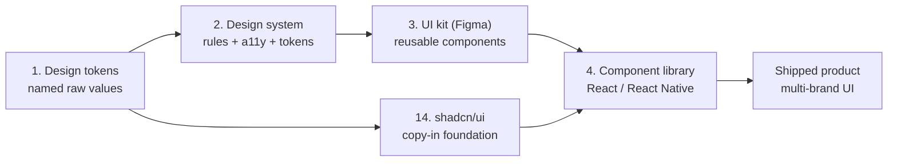
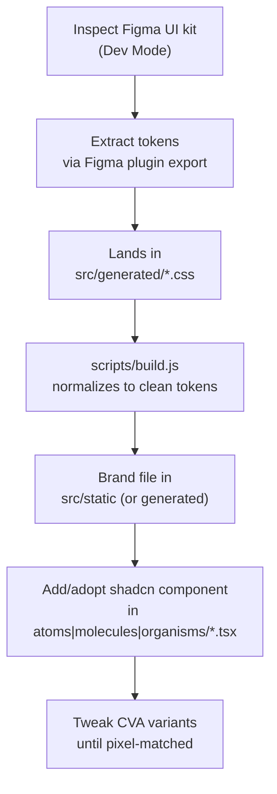

# Design System Basics — Concepts & How They Map to This Repo

This is the conceptual on-ramp for the `b2spin-uikit` monorepo. It explains the foundational ideas behind a modern design system — design tokens, UI kits, component libraries, Figma handoff, and shadcn/ui — and, for each idea, points at exactly where it lives in this codebase.

If this doc answers "what are these concepts and why do they exist," then [docs/ARCHITECTURE.md](docs/ARCHITECTURE.md) answers "how is it wired together end-to-end." Read this first if you're new to design systems or to this repo; read ARCHITECTURE next for the deep mechanics.

---

## Table of Contents

- [The big picture pipeline](#the-big-picture-pipeline)
- [1. Design tokens](#1-design-tokens)
- [2. Design system](#2-design-system)
- [3. UI kit (Figma)](#3-ui-kit-figma)
- [4. Component library (code)](#4-component-library-code)
- [5. Component variants & states](#5-component-variants--states)
- [6. Auto Layout → Flexbox/Grid](#6-auto-layout--flexboxgrid)
- [7. Spacing & grid system](#7-spacing--grid-system)
- [8. Typography scale](#8-typography-scale)
- [9. Responsive & breakpoints](#9-responsive--breakpoints)
- [10. Inspect / Dev Mode](#10-inspect--dev-mode)
- [11. Asset export](#11-asset-export)
- [12. Handoff documentation](#12-handoff-documentation)
- [13. Design-to-code tools](#13-design-to-code-tools)
- [14. shadcn/ui as the component foundation](#14-shadcnui-as-the-component-foundation)
- [15. Tailwind + shadcn token mapping](#15-tailwind--shadcn-token-mapping)
- [16. Customizing shadcn to match Figma](#16-customizing-shadcn-to-match-figma)
- [17. The Figma → shadcn workflow](#17-the-figma--shadcn-workflow)
- [18. Component variants in code (cva)](#18-component-variants-in-code-cva)

---

## The big picture pipeline

The same idea travels through several forms — from a raw value a designer picks, all the way to a styled pixel on screen. Each stage has an owner and an artifact.



In this repo:

| Stage                | Artifact                      | Where it lives                                                                                           |
| -------------------- | ----------------------------- | -------------------------------------------------------------------------------------------------------- |
| Design tokens        | CSS custom properties         | [packages/uikit-themes/src/static](packages/uikit-themes/src/static)                                     |
| Design system        | Token + component conventions | this repo as a whole (+ [docs/ARCHITECTURE.md](docs/ARCHITECTURE.md))                                    |
| UI kit               | Figma file                    | external Figma, exported into [packages/uikit-themes/src/generated](packages/uikit-themes/src/generated) |
| Component library    | React + React Native code     | [packages/uikit-web](packages/uikit-web), [packages/uikit-native](packages/uikit-native)                 |
| shadcn/ui foundation | copied-in components          | [packages/uikit-web/src](packages/uikit-web/src) (`atoms/`, `molecules/`, `organisms/`)                  |

---

## 1. Design tokens

**Concept.** Design tokens are the smallest units of a design language: raw, named values such as colors (`#3B82F6`), spacing (`4px`, `8px`, `16px`), font sizes, border radii, and shadows. Naming them (e.g. `color-primary-500`, `space-md`) means a value is defined once and reused everywhere, instead of being hardcoded in dozens of places.

**In this repo.** Each supported brand defines the same DS v2 contract in
[packages/uikit-themes/src/static](packages/uikit-themes/src/static): semantic colors such as
`--color-background-brand-primary-container`, a bridged radius scale
(`--radius-base`, `--radius-offset*`), thin `--components-*` aliases for existing components, and
responsive typography such as `--typography-font-size-label-l`. Shared Figma primitives live in
`packages/uikit-themes/src/foundation/config.css`.

---

## 2. Design system

**Concept.** A design system is the overarching rulebook: tokens + components + usage rules + accessibility standards that together define how a product looks and behaves. It's bigger than any one file — it's the agreement that keeps a product consistent.

**In this repo.** The system is the monorepo itself. Its defining principle:

> Brand identity lives entirely in **CSS custom properties**. Components are brand-agnostic.

A `Button` asks for `--color-background-brand-primary-container`; it does not know which primitive
the active brand assigns to that role. The rules of the system (one `.tsx` per component, CVA for
variants, `cn()` for class merging, accessibility via Radix/rn-primitives) are documented in
[CLAUDE.md](CLAUDE.md) and [docs/ARCHITECTURE.md](docs/ARCHITECTURE.md).

---

## 3. UI kit (Figma)

**Concept.** The UI kit is the actual Figma file containing reusable components (buttons, inputs, cards, modals) built from the tokens. It's what designers drag onto the canvas to assemble screens.

**In this repo.** The Figma side is external, but it connects here through a Figma plugin export. Those raw exports land in [packages/uikit-themes/src/generated](packages/uikit-themes/src/generated) using Figma-style variable names (e.g. `--components_button_default_background_color-mcluck`). The build script then filters, resolves, and renames them into the same clean token shape as the hand-authored `static/` files — so a Figma-sourced brand and a hand-written one are indistinguishable downstream. See [docs/ARCHITECTURE.md](docs/ARCHITECTURE.md) section 4 ("Figma raw exports") for the transform steps.

---

## 4. Component library (code)

**Concept.** The component library is the code equivalent of the UI kit. Each Figma component should map to a coded component (React, Vue, etc.) with matching props and variants, so what a designer assembles in Figma a developer can assemble in code.

**In this repo.** Two parallel libraries mirror each other's API surface:

| Package                                        | Platform       | Components | Primitives                  |
| ---------------------------------------------- | -------------- | ---------- | --------------------------- |
| [packages/uikit-web](packages/uikit-web)       | React 19 (web) | 37         | Radix UI, CVA, Tailwind v4  |
| [packages/uikit-native](packages/uikit-native) | React Native   | 16         | rn-primitives, CVA, Uniwind |

Most components are a single `.tsx` file under `src/{atoms,molecules,organisms}/` (for example [packages/uikit-web/src/atoms/Button.tsx](packages/uikit-web/src/atoms/Button.tsx)); a component with sub-components, a hook, or helpers of its own instead gets a `foo/` directory with an `index.tsx` barrel (for example [packages/uikit-web/src/organisms/Stepper](packages/uikit-web/src/organisms/Stepper)). `tsup` auto-discovers both layouts across all three level directories and consumers import by sub-path regardless of level or layout (`import { Button } from '@ui/web/Button'`).

---

## 5. Component variants & states

**Concept.** Every interactive component needs its variants (primary/secondary) and states (hover, active, disabled, focus, loading) defined in Figma _before_ coding — otherwise you're guessing what a pressed or disabled button should look like.

**In this repo.** Variants and states are expressed with CVA plus Tailwind pseudo-class utilities
that reference DS v2 tokens. Component dimensions use Tailwind's spacing scale, while typography,
radius, border, and colors use the Figma contract.

States map to specific token + pseudo-class combinations:

| Figma state | Code mechanism                     | Example                                                       |
| ----------- | ---------------------------------- | ------------------------------------------------------------- |
| Hover       | `hover:` utility + state token     | `hover:bg-linear-[...var(--color-background-state-hover)...]` |
| Disabled    | `disabled:` utility + state tokens | `disabled:bg-background-state-disabled`                       |
| Focus       | `focus-visible:` border utilities  | `focus-visible:after:border-border-state-focus`               |
| Loading     | runtime prop swaps content         | `isLoading` renders `<Loader2 className="animate-spin" />`    |

Because every state reads a token, the same `Button` code renders correctly across all brands.

---

## 6. Auto Layout → Flexbox/Grid

**Concept.** Figma's Auto Layout maps almost directly to CSS Flexbox/Grid. Understanding it is high-leverage for frontend devs, because padding, gap, and resizing behavior in Figma should translate predictably to CSS.

**Mapping.**

| Figma Auto Layout               | CSS equivalent                        |
| ------------------------------- | ------------------------------------- |
| Horizontal / vertical direction | `flex-direction: row / column`        |
| Gap between items               | `gap`                                 |
| Padding                         | `padding`                             |
| "Hug contents"                  | `width: fit-content` / intrinsic size |
| "Fill container"                | `flex: 1` / `width: 100%`             |
| Alignment controls              | `justify-content` / `align-items`     |
| Wrap                            | `flex-wrap: wrap`                     |

**In this repo.** Components express this directly with Tailwind utilities. The `Button` base uses `inline-flex items-center justify-center gap-2` — the literal CSS translation of a horizontal Auto Layout frame with centered alignment and a fixed gap.

---

## 7. Spacing & grid system

**Concept.** Spacing is usually built on a scale of `4px` or `8px` increments. Those increments become your spacing tokens, which keeps layouts rhythmic instead of arbitrary.

**In this repo.** Tailwind v4's default spacing scale (multiples of `0.25rem` = `4px`) is used for
layout utilities like `px-4`, `py-2`, and `gap-2`. Brand-specific component radii and border widths
are thin DS v2 tokens backed by shared Figma primitives.

---

## 8. Typography scale

**Concept.** Typography should be defined as reusable styles — font families, weights, sizes, and line-heights — not ad-hoc values sprinkled across screens.

**In this repo.** Each brand provides `--typography-font-family`, shared font-weight roles, and a
responsive `--typography-font-size-*` scale. Mobile values are the default; selected display and
heading roles change at `min-width: 1024px`.

---

## 9. Responsive & breakpoints

**Concept.** Designers provide Figma frames at common breakpoints (mobile, tablet, desktop) so developers know how layouts adapt as the viewport changes.

**In this repo.**

- **Web:** use Tailwind's responsive prefixes (`sm:`, `md:`, `lg:`, `xl:`, `2xl:`) directly in `className` strings. The token scale itself is breakpoint-agnostic; layout responds via these prefixes. Typography even ships breakpoint variants like `--typography-components-h1-font-size-lg: 48px`.
- **Native:** React Native has no media queries; adaptation is done with fl* layout, `Dimensions`, and platform conditionals rather than breakpoint prefixes. See [docs/ARCHITECTURE.md](docs/ARCHITECTURE.md) section 6 for the native flow.

---

## 10. Inspect / Dev Mode

**Concept.** Figma's Dev Mode (formerly the Inspect panel) lets you click an element and read its CSS values, spacing, and exported assets directly. It is the primary bridge from design to code.

**In this repo.** Dev Mode is where you read the _intended_ values, but you should not paste raw CSS from it into components. Instead, map what you see to the matching token name. If Dev Mode shows a button radius of `6px`, that becomes `--button-default-border-radius: 6px` in the brand file, and the component already references `rounded-(--button-default-border-radius)`. Dev Mode tells you _which token_ and _what value_, not what to hardcode.

---

## 11. Asset export

**Concept.** Icons and images should be exported as SVG/PNG at correct scales (`1x`, `2x`, `3x`) rather than screenshotted, so they stay crisp at every density.

**In this repo.** Icons are not exported one-by-one — they come from the Lucide icon set: `lucide-react` on web (e.g. `Loader2` in [packages/uikit-web/src/atoms/Button.tsx](packages/uikit-web/src/atoms/Button.tsx)) and Lucide RN wrapped with `withUniwind` on native. Icon color and size are driven by tokens/classes (`[&_svg:not([class*='size-'])]:size-4`), so they inherit theming. For brand-specific raster assets, export PNG at `1x/2x/3x` and SVG for anything that can be vector.

---

## 12. Handoff documentation

**Concept.** Handoff docs are the annotations, component specs, and interaction notes (what happens on click, animations, edge cases) that usually live in Figma comments or a linked doc. They prevent the "the design didn't say what the empty state looks like" problem.

**In this repo.** The code side of handoff is automated:

- **JSDoc on each component** documents props, variants, examples, and the exact CSS variables it consumes (see the large doc block above `Button` in [packages/uikit-web/src/atoms/Button.tsx](packages/uikit-web/src/atoms/Button.tsx)).
- **`ai-docs.json`** is generated from that JSDoc (`pnpm codegen:docs`).
- **An MCP server** ([docs/mcp-server.md](docs/mcp-server.md)) exposes that documentation to AI assistants so they look up component APIs and tokens instead of guessing.

This is the machine-readable counterpart to Figma annotations.

---

## 13. Design-to-code tools

**Concept.** Tools like Figma's own code suggestions, or generators that turn frames into code, are useful as a _starting point_ but rarely produce production-ready output. Treat their output as a draft to refactor against your system, not as final code.

**In this repo.** Any generated markup must be reworked to follow the conventions: single `.tsx` per component, CVA for variants, token references instead of hardcoded values, and `cn()` for class merging. A generated button with `background: #18181b` is wrong here even if it looks right — it must become `bg-linear-[...var(--button-default-background-color-start)...]` so it themes across brands.

---

## 14. shadcn/ui as the component foundation

**Concept.** shadcn/ui is not a traditional npm component library. It's a collection of pre-built, accessible React components (built on Radix UI primitives + Tailwind CSS) that you **copy into your codebase** via a CLI (`npx shadcn@latest add button`). Because you own the code, you can freely restyle it to match your design tokens — instead of building buttons, dialogs, dropdowns, and tooltips from scratch.

**In this repo.** Every file under [packages/uikit-web/src](packages/uikit-web/src)'s `atoms/`, `molecules/`, and `organisms/` directories started life as a shadcn component — note the `@see https://ui.shadcn.com/docs/components/button` reference in the `Button` JSDoc. They've been adopted into the repo and rewired so all visual values come from tokens. There is also a dedicated `shadcn` brand: a neutral light-mode baseline (slate grays, `--radius-md: 6px`, `Inter`) that the other B2Spin brands diverge from. See the Brands table in [docs/ARCHITECTURE.md](docs/ARCHITECTURE.md) section 7.

---

## 15. Tailwind + shadcn token mapping

**Concept.** shadcn relies on Tailwind config and CSS variables (`--primary`, `--radius`, `--background`, etc.). This layer is the frontend's version of step 1 (design tokens): you map your Figma tokens into Tailwind's theme and shadcn's CSS variables.

**In this repo.** There is **no `tailwind.config.js`** — this is Tailwind v4, which configures theme tokens in CSS. The mapping happens in `foundation/config.css` via `@theme inline`, which connects a brand token to a Tailwind utility token:

```css
@theme inline {
  --color-background: var(--background);
  --color-primary: var(--primary);
  --radius-md: var(--radius-md);
  --font-sans: var(--font-sans);
}
```

So `--background: #ffffff` (a token) makes `bg-background` (a class) resolve to white. This is the exact "map your tokens into Tailwind" step, done the v4 way. Full detail in [docs/ARCHITECTURE.md](docs/ARCHITECTURE.md) section 4.

---

## 16. Customizing shadcn to match Figma

**Concept.** shadcn components ship with sensible defaults, not your brand. Customizing means adjusting variants, sizes, and states to mirror exactly what's in the Figma UI kit — button paddings, hover states, focus rings, radii.

**In this repo.** Customization is done two ways, both token-driven:

1. **Change the values** a component reads — edit the brand file (e.g. set `--button-default-border-radius: 16px` for `mcluck`). The component code never changes.
2. **Change which tokens a variant references** — edit the CVA config in the `.tsx` when a brand needs structurally different styling.

The pattern is deliberate: pixel-matching Figma should usually be a token edit, not a component edit, so all brands stay in sync.

---

## 17. The Figma → shadcn workflow

**Concept.** A common, beginner-friendly order of operations:

1. Build/inspect the Figma UI kit.
2. Extract tokens (colors, spacing, radius, fonts).
3. Set those as CSS variables / Tailwind theme.
4. Add shadcn components matching your Figma components.
5. Adjust class names/variants until pixel-matched.

**In this repo**, the same loop maps to concrete actions:



Steps 1–3 are the theming pipeline; steps 4–5 are component work. The handoff between them is the token name.

---

## 18. Component variants in code (cva)

**Concept.** shadcn uses `class-variance-authority` (cva) to manage variants (primary/secondary, sm/md/lg). This is the code equivalent of the variants you set up in Figma (section 5): one source of truth that enumerates every legal combination.

**In this repo.** CVA is the standard for every component. A variant config declares the options, and `VariantProps` derives the TypeScript prop types automatically:

```174:174:packages/uikit-web/src/atoms/Button.tsx
const buttonVariants = cva(base, config);
```

```181:186:packages/uikit-web/src/atoms/Button.tsx
type ButtonProps<T extends React.ElementType = "button"> = Omit<React.ComponentProps<T>, "as"> & {
  as?: T;
  isLoading?: boolean;
  /** Names the button; the spinner becomes `<testId>-spinner`. */
  "data-testid"?: string;
} & VariantProps<typeof buttonVariants>;
```

`as` is the polymorphism prop across the kit — it names the element the component renders,
so a router link is `as={BrandLink} href="/x"` rather than a `Slot` wrapped around one — where
`BrandLink` is the app's own `components/Link`, aliased because the kit exports a `Link` of its
own. What tag comes out is that component's decision; `as` only says which component renders.
No component in the kit owns an `asChild` prop any more. What is left of `asChild` is either a
Radix primitive's own prop passed through — `DropdownMenuTrigger`, `CollapsibleTrigger`, every
`*Trigger` and `*Close`, where the consumer supplies the element rather than naming it — or an
internal `<Slot>` dressing a node handed over as a prop, which nobody can pass at all.

A Figma variant set ("Variant: primary | secondary | …", "Size: sm | md | lg") should map one-to-one to a CVA `variants` block — which is exactly how `Button` is structured. The native library uses the same CVA pattern, often with a split view/text config because React Native styles `<Pressable>` and `<Text>` separately (see [docs/ARCHITECTURE.md](docs/ARCHITECTURE.md) section 3).
